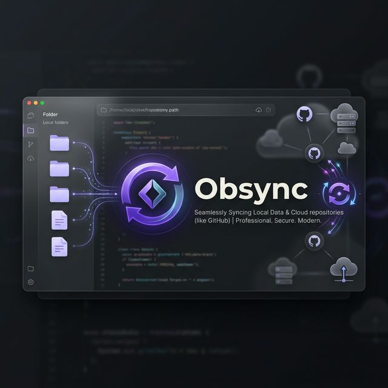

<p align="center">
  
</p>

# 🚀 Obsync

### Sync your Obsidian vaults with GitHub, elegantly.

**Obsync** is a premium, high-performance desktop application designed to bridge the gap between your local Obsidian notes and GitHub. Built with a focus on speed, security, and a stunning "Glassmorphism" aesthetic, Obsync ensures your knowledge base is always safe, versioned, and synchronized across all your devices.

---

## ✨ Key Features

- **💎 Premium Glassmorphism UI**: A native-feeling interface aligned with Obsidian's modern design language.
- **🔄 Instant Sync**: One-click Push and Pull operations with real-time progress tracking.
- **☁️ Cloud Import**: Seamlessly clone existing vaults from GitHub to any device with a single click.
- **⏯️ Auto-Sync Logic**: Intelligent background file watching that automatically pushes changes after you finish typing.
- **⚔️ Conflict Resolution**: Built-in detection for merge conflicts to prevent data loss.
- **📜 Sync History**: Keep track of every update and view detailed file diffs directly within the app.
- **🔒 Secure by Design**: GitHub tokens are AES-encrypted locally and never exposed in the UI or transmitted anywhere except to GitHub's official API.

---

## 🛠️ Technology Stack

Obsync is built with a commitment to simplicity and performance, avoiding heavy frameworks for a lightweight experience:

- **Core**: Electron (Main & Renderer)
- **Logic**: TypeScript
- **Styling**: Vanilla CSS (Modern Variables, Flexbox, Grid)
- **VCS**: Simple-Git & Native Git binary integration

---

## 🚀 Getting Started

### Prerequisites

- [Node.js](https://nodejs.org/) (v16+)
- [Git](https://git-scm.com/) installed on your system path.

### Installation

1. **Clone the repository:**
   ```bash
   git clone https://github.com/your-username/obsync.git
   cd obsync/obsync
   ```

2. **Install dependencies:**
   ```bash
   npm install
   ```

3. **Build and Run:**
   ```bash
   npm run start
   ```

---

## 🔧 Configuration

To start syncing, you will need:
1. A **GitHub Personal Access Token (PAT)** with `repo` scope.
2. The **HTTPS URL** of your repository.

Obsync will guide you through the setup when you add your first vault!

---

<p align="center">
  Made with ❤️ for the Obsidian Community.
</p>
